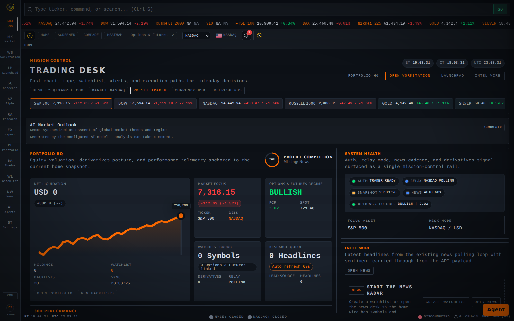
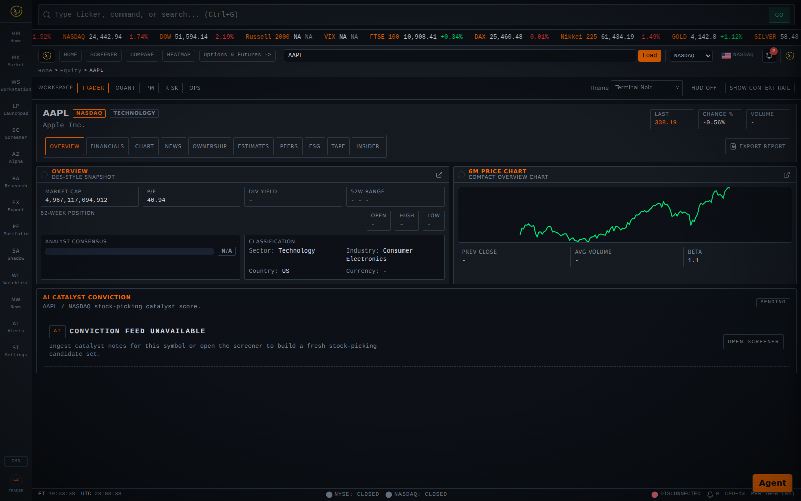
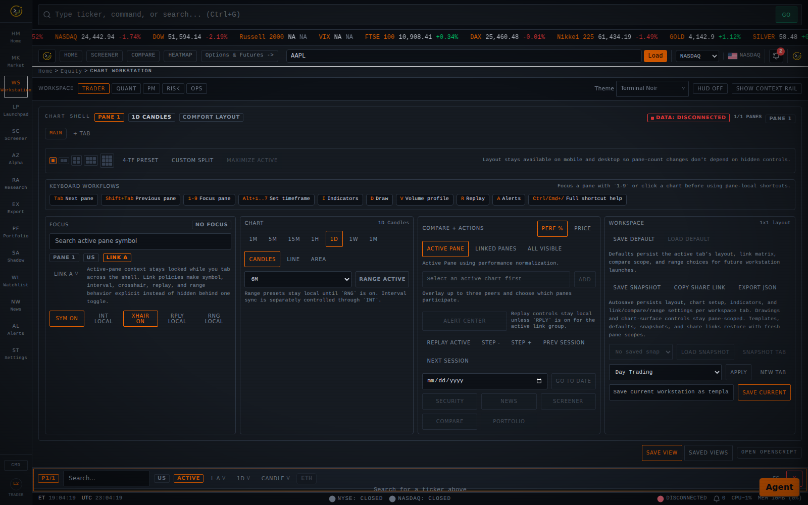
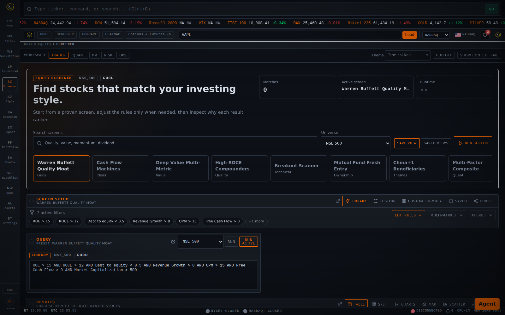
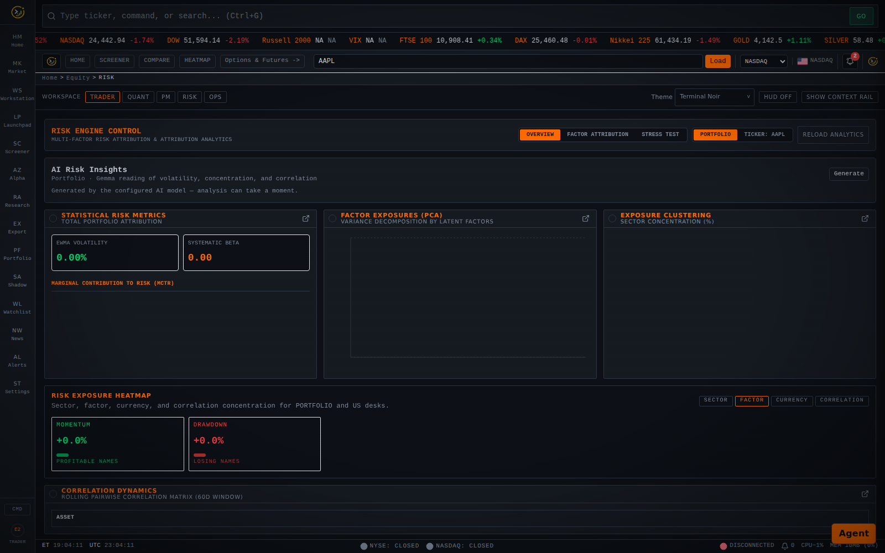
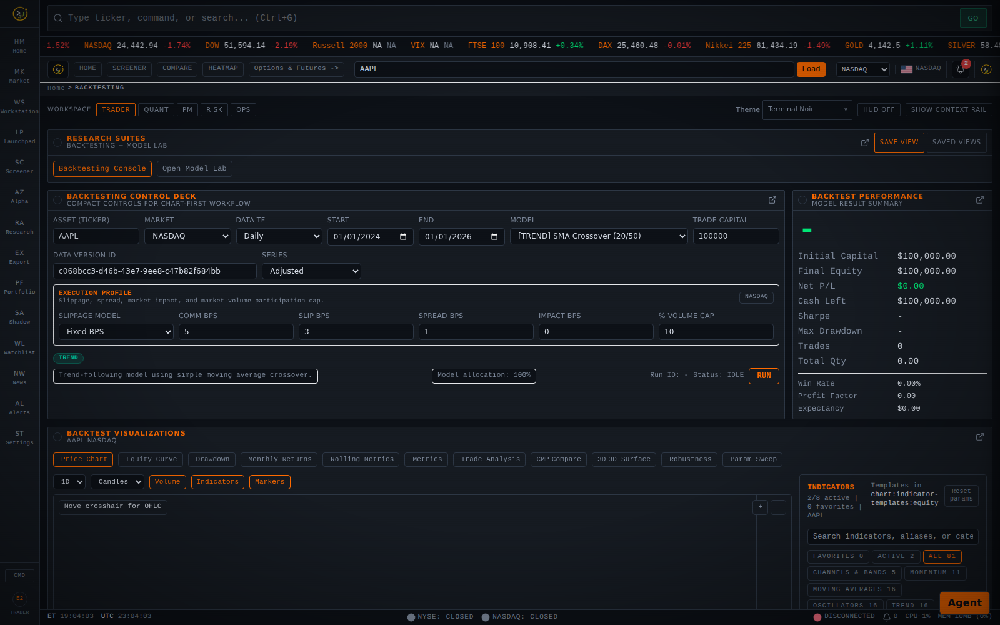
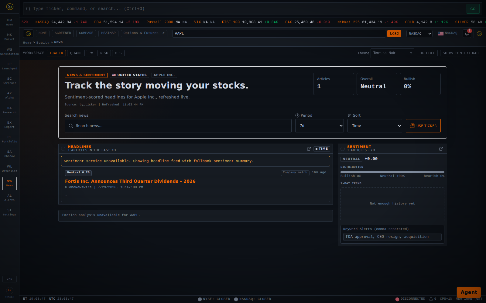

# OpenTerminalUI

<p align="center">
  
</p>

<p align="center">
  <strong>The open-source financial terminal for traders, researchers, and quant teams.</strong>
</p>

<p align="center">
  
  
  
  
  
  
  
  
  
</p>

<p align="center">
  <a href="https://dhjh24.github.io/openterminal/">Website</a> |
  <a href="#features">Features</a> |
  <a href="#screenshots">Screenshots</a> |
  <a href="#architecture">Architecture</a> |
  <a href="#quick-start">Quick Start</a> |
  <a href="CONTRIBUTING.md">Contributing</a>
</p>

---

OpenTerminalUI is a self-hosted, full-stack financial terminal for **U.S. markets** that combines real-time market data, institutional-grade charting, derivatives analytics, portfolio management, and quant research into a single platform. Built with a terminal-style shell interface inspired by Bloomberg and Refinitiv, it delivers professional-grade workflows to anyone with a browser.

**U.S. exchange coverage** across **NASDAQ and NYSE** (tested REST quotes and streaming), with supported asset classes including **equities**, **U.S. options**, **ETFs**, **futures**, **crypto**, **forex**, and **fixed income**. **70+ technical indicators**, **multi-panel chart workstations**, **Options & Futures chains with locally calculated Greeks**, **backtesting with Model Lab**, **statistical arbitrage with Pair Trading Lab**, **Portfolio Lab and optimizer workflows**, **paper trading and trade journal**, **OMS / ops / data-quality consoles**, **saved views and launchpad workspaces**, a **tool-using AI research agent with multi-agent debate and Strategy Lab**, and an **extensible plugin system** &mdash; all running on your own hardware.

> **Market profile:** OpenTerminalUI ships as a **U.S.-only** product (`MARKET_PROFILE=US`). For migration notes, provider behavior, and configuration details, see [docs/US_MARKET_MIGRATION.md](docs/US_MARKET_MIGRATION.md).

## Screenshots

Captured from the rebuilt Docker image running at `http://localhost:8000`. Account-backed screens are seeded before capture so portfolio, watchlist, paper trading, and journal views show populated data.

### Complete Feature Gallery

#### Mission Control & Navigation

| Mission Control | Launchpad |
|---|---|
|  |  |

| Market Dashboard | Account |
|---|---|
|  |  |

#### Equity Research & Markets

| Market View | Security Hub |
|---|---|
|  |  |

| Financial Analysis | Chart Workstation |
|---|---|
|  |  |

| Multi-Timeframe | DOM |
|---|---|
|  |  |

| Time & Sales | Split Compare |
|---|---|
|  |  |

| Market Heatmap | Hotlists |
|---|---|
|  |  |

| Watchlist | Screener |
|---|---|
|  |  |

| Factor Dashboard | Relative Strength |
|---|---|
|  |  |

| Sector Rotation | Dividends |
|---|---|
|  |  |

| Insider Activity |
|---|---|
|  | |

#### Portfolio, Risk & Trading

| Portfolio | Portfolio Lab |
|---|---|
|  |  |

| Portfolio Optimizer | Risk Dashboard |
|---|---|
|  |  |

| Correlation Dashboard | Cockpit |
|---|---|
|  |  |

| Paper Trading | Position Sizer |
|---|---|
|  |  |

| Trade Journal | Alerts |
|---|---|
|  |  |

#### Quant Research & Backtesting

| Backtesting | Model Lab |
|---|---|
|  |  |

| Model Governance | Algorithm Framework |
|---|---|
|  |  |

| Statistical Lab | Pair Trading |
|---|---|
|  |  |

#### Options & Futures

| Option Chain | Greeks |
|---|---|
|  |  |

| Futures | OI Analysis |
|---|---|
|  |  |

| Strategy Builder | PCR |
|---|---|
|  |  |

| Options Flow | Options Heatmap |
|---|---|
|  |  |

| Expiry Calendar | Option Greeks Calculator |
|---|---|
|  |  |

#### Cross-Asset & Macro

| Commodities | Forex |
|---|---|
|  |  |

| Crypto | ETF Analytics |
|---|---|
|  |  |

| Mutual Funds | Bonds |
|---|---|
|  |  |

| Yield Curve | Bond Analytics |
|---|---|
|  |  |

| Economic Terminal | Data Quality |
|---|---|
|  |  |

#### Intelligence, AI & Platform

| News & Sentiment | Intelligence Timeline |
|---|---|
|  |  |

| AI Research Agent | Multi-Agent Debate |
|---|---|
|  |  |

| Strategy Lab Agent | Research Library |
|---|---|
|  |  |

| OMS Compliance | Ops Dashboard |
|---|---|
|  |  |

| Plugins | Settings |
|---|---|
|  |  |

| Saved Views |
|---|
|  |

### Workspace & Markets

<p align="center">
  
</p>
<p align="center"><em>Home / Mission Control — market context, AI Market Outlook, portfolio hub, system health, and the full feature launch grid.</em></p>

<p align="center">
  
</p>
<p align="center"><em>Multi-panel chart workstation — a 6-chart grid with synchronized crosshairs, 70+ technical indicators, and drawing tools.</em></p>

<p align="center">
  
</p>
<p align="center"><em>Full-screen market view (AAPL, NASDAQ) — candlestick price action with volume, multi-timeframe, and indicator overlays.</em></p>

<p align="center">
  
</p>
<p align="center"><em>Security Hub for a U.S. equity (AAPL, NASDAQ) — quotes, fundamentals, price chart, analysis tabs, and the AI Catalyst &amp; Conviction panel.</em></p>

<p align="center">
  
</p>
<p align="center"><em>Financial analysis — income statement, balance sheet, and cash-flow statements with multi-period trends.</em></p>

<p align="center">
  
</p>
<p align="center"><em>Options &amp; Futures (SPY / AAPL) — option chain with locally calculated Greeks, open-interest build-up, and PCR signals for U.S. underliers.</em></p>

<p align="center">
  
</p>
<p align="center"><em>Cross-asset coverage — commodities, forex, crypto, U.S. bonds, ETFs, and mutual funds.</em></p>

### Research & Stock Picking

<p align="center">
  
</p>
<p align="center"><em>Advanced screener with query builder, custom formula engine, composite factor scores, and "why ranked" insights.</em></p>

<p align="center">
  
</p>
<p align="center"><em>Factor Dashboard — multi-factor (Value / Momentum / Quality / Low-Vol) idea lists and ranked picks for U.S. equities.</em></p>

<p align="center">
  
</p>
<p align="center"><em>News &amp; Sentiment with the AI Emotion Indicator powered by a local Gemma model via LM Studio.</em></p>

<p align="center">
  
</p>
<p align="center"><em>Unified Intelligence Timeline — news, alerts, events, insider activity, earnings, and model signals in one feed.</em></p>

### Portfolio, Risk & Backtesting

<p align="center">
  
</p>
<p align="center"><em>Portfolio monitoring — holdings, movement &amp; historical return, risk metrics, and AI Risk Assessment.</em></p>

<p align="center">
  
</p>
<p align="center"><em>Cockpit Priority Stack — a ranked daily brief across portfolio risk, alerts, catalysts, movers, and model signals.</em></p>

<p align="center">
  
</p>
<p align="center"><em>Risk dashboard with statistical risk metrics, factor/exposure heatmaps, and AI Risk Insights powered by Gemma.</em></p>

<p align="center">
  
</p>
<p align="center"><em>Backtesting workspace with strategy presets, execution-profile modeling, performance summary, and AI analysis.</em></p>

<p align="center">
  
</p>
<p align="center"><em>Model Lab — parameter sweeps, walk-forward validation, Monte Carlo robustness, and run leaderboards.</em></p>

<p align="center">
  
</p>
<p align="center"><em>Portfolio Lab — multi-asset portfolio backtests, strategy blends, and correlation analysis.</em></p>

<p align="center">
  
</p>
<p align="center"><em>Watchlists with live quotes, heatmap view, and one-click routing to charts, screener, and backtests.</em></p>

### AI Research Agent

<p align="center">
  
</p>
<p align="center"><em>The tool-using research agent (<code>Ctrl/Cmd&nbsp;+&nbsp;J</code>) — a screen-aware verdict on AAPL backed by a live snapshot card it fetched itself.</em></p>

<p align="center">
  
</p>
<p align="center"><em>Multi-agent debate — an analyst team (fundamental / sentiment / technical) each returns an evidence-backed verdict, which feeds a bull-vs-bear debate and a portfolio-manager decision.</em></p>

<p align="center">
  
</p>
<p align="center"><em>Strategy Lab — the agent proposes a strategy, backtests it, changes one variable to iterate, then runs out-of-sample validation and reports an honest verdict (here, "not a validated edge" at p&nbsp;=&nbsp;0.25).</em></p>

## Features

### Terminal Shell

- **GO Bar** (`Ctrl+G`) &mdash; Bloomberg-style command bar with symbol lookup and route navigation
- **Command Palette** (`Ctrl+K`) &mdash; fuzzy search across 25+ functions, tickers, and natural language queries
- **Function Keys** (`F1`-`F9`) &mdash; rapid workspace switching with Bloomberg-style hotkeys
- **Ticker Tape** &mdash; rolling market pulse with live quotes across U.S. exchanges
- **Theme Engine** &mdash; Terminal Noir (default), classic, and light themes with custom accent support
- **Desktop & Mobile Layouts** &mdash; responsive design with persistent workspace framing

### Charting & Technical Analysis

- **Multi-Panel Workstation** &mdash; up to 9 synchronized chart panels with crosshair linking
- **70+ Technical Indicators** &mdash; SMA, EMA, RSI, MACD, Bollinger Bands, Keltner, Supertrend, ATR, VWAP, OBV, CMF, Stochastic, CCI, ADX, Donchian, and many more
- **Multi-Timeframe** &mdash; 1m, 2m, 5m, 15m, 30m, 1h, 4h, 1D, 1W, 1M with extended hours toggle
- **Drawing Tools** &mdash; persistent annotations with templates, save/restore
- **Volume Profile** &mdash; VPOC + 70% value area overlay
- **Replay Mode** &mdash; step through historical price action bar by bar
- **Comparison Overlays** &mdash; multi-symbol normalized or raw price comparison
- **Alternative Charts** &mdash; Renko, Kagi, Point & Figure, Line Break
- **Chart Export** &mdash; PNG, SVG, and CSV data export
- **OpenScript** &mdash; custom indicator scripting with script library

### Equity Research & Security Hub

- **8-Tab Security Analysis** &mdash; overview, financials, chart, news/sentiment, ownership, estimates, peers, ESG
- **Fundamental Metrics** &mdash; P/E, P/B, ROE, ROA, dividend yield, earnings growth, debt ratios
- **Earnings Calendar** &mdash; historical surprises, upcoming events, guidance tracking
- **Shareholding / Ownership** &mdash; institutional and insider ownership trends with SEC filing context
- **Analyst Estimates** &mdash; consensus tracking, revisions, and target prices
- **Corporate Actions** &mdash; splits, dividends, rights, bonuses timeline
- **Peer Comparison** &mdash; relative valuation matrices across comparable companies
- **Insider Trading Monitor** &mdash; recent insider trades, per-stock insider activity, top buyers/sellers leaderboard, and cluster-buy detection with minimum insider thresholds
- **Trade Journal** &mdash; trade logging with equity curve, calendar heatmap, and performance statistics

### Advanced Screener

- **Query Builder** &mdash; custom filters with preset formulas and arithmetic operations
- **Custom Formula Engine** &mdash; write, save, and share custom formulas with server-side evaluation, formula library with descriptions and categories
- **15+ Visualization Modes** &mdash; tables with sparklines, sector treemaps, heatmaps, scatter plots, radar charts, box plots, bubble charts, waterfall charts, RRG quadrants, gauge dials, distribution histograms, stacked area, and comparison bars
- **U.S. Market Scanning** &mdash; NASDAQ and NYSE universes with technical and fundamental overlays
- **Preset Management** &mdash; save, load, share, and browse community screens
- **Score-Based Ranking** &mdash; deterministic scoring with stable ordering and explainable setup detection

### Insight-Driven Stock Picking

- **Multi-Factor Composite Scoring** &mdash; cross-sectional, sector-relative Value / Momentum / Quality / Low-Volatility z-scores combined into a weighted composite rank
- **Ranked Idea Lists** &mdash; top-quintile picks per sector across NYSE and NASDAQ universes
- **Factor Dashboard** &mdash; per-symbol factor radar, factor chips, and conviction scoring for U.S. equities
- **Catalyst & Conviction Engine** &mdash; LLM-extracted sentiment and upcoming catalysts from SEC/EDGAR filings, surfaced in the Security Hub
- **Point-in-Time Fundamentals** &mdash; as-reported fundamental history that removes look-ahead bias from factor and fundamental backtests
- **Why-Ranked Explanations** &mdash; composite scores, factor chips, and plain-language rationale on screener rows, with one-click routing to chart and backtest

### AI Research Agent

- **Conversational Console** &mdash; a slide-over agent panel (toggle with **Ctrl/Cmd + J**) that researches and analyzes stocks on demand
- **Tool-Using Agentic Loop** &mdash; the agent autonomously calls read-only tools &mdash; screener, full stock snapshot, multi-ticker compare, and research-knowledge-base search (RAG) &mdash; and reasons over the results
- **Screen-Aware Context** &mdash; defaults to the stock you currently have open and your selected market, so "tell me about this stock" resolves to the right ticker/exchange without re-typing it
- **Multi-Agent Debate Mode** &mdash; an analyst team (fundamental / sentiment / technical) feeds a bull-vs-bear debate that a portfolio manager resolves into a `BUY / HOLD / SELL` decision with a conviction score
- **Strategy Lab (idea &rarr; tested result loop)** &mdash; a bounded, read-only research loop that proposes a strategy, backtests it, changes one variable to iterate toward a target metric, then runs **mandatory out-of-sample validation** (permutation + multi-window robustness) and reports an honest verdict &mdash; refusing to call a curve-fit result an edge. Flag-gated and capped on rounds and wall-clock
- **Beautifully Rendered Output** &mdash; answers render as styled markdown (headings, tables, lists), stock snapshots as crafted cards (logo, price, valuation/quality/growth metrics), and debates as a phase stepper with bull/bear cards and a decision banner with conviction meter
- **Provider-Flexible** &mdash; runs against OpenRouter, OpenAI, or a local **LM Studio** model, with an automatic free-model fallback chain and per-phase model routing
- **MCP Server** &mdash; the read-only agent tools (screener, snapshot, compare, technicals, backtests, research search) are also exposed over the Model Context Protocol for use by external MCP clients
- **Read-Only & Resilient** &mdash; the agent never places orders or mutates data, and degrades gracefully on rate limits, empty completions, or unavailable data sources

### Options & Futures

- **Option Chain** &mdash; full U.S. contract listing with locally calculated Greeks (Delta, Gamma, Theta, Vega, Rho)
- **IV Analysis** &mdash; historical and implied volatility tracking, term structure visualization
- **Strategy Builder** &mdash; multi-leg construction for spreads, butterflies, straddles, strangles
- **OI Analysis** &mdash; open interest trends, buildup patterns, strike-level concentration
- **PCR Tracking** &mdash; put-call ratio monitoring with overbought/oversold signals
- **Heatmaps** &mdash; IV/volume/OI heatmaps across the strike grid
- **Options Flow** &mdash; unusual activity scanner with volume/OI ratios, premium tracking, heat scores, and bullish/bearish sentiment classification
- **Futures Analytics** &mdash; term structure, basis analysis, contract specifications
- **Expiry Calendar** &mdash; contract schedules with roll suggestions

### Portfolio & Risk Management

- **Multi-Portfolio CRUD** &mdash; holdings management with cost basis and transaction tracking
- **Allocation & Attribution** &mdash; sector allocation charts, contributor/detractor analysis
- **Benchmark Overlay** &mdash; compare against indices with relative performance metrics
- **Risk Engine** &mdash; VaR (95%), CVaR, EWMA volatility, rolling correlation, PCA factor exposures
- **Factor Analytics** &mdash; multi-factor exposure radar, attribution waterfall, rolling factor history, and factor return comparison across market, size, value, momentum, quality, and low-volatility factors
- **Stress Testing** &mdash; 6 predefined macro scenarios (GFC 2008, COVID 2020, rate shock, USD strength, tech rotation, commodity spike), custom shock builder, Monte Carlo simulation, and historical event replay
- **Correlation Deep Dive** &mdash; correlation matrix, rolling correlation with regime detection, hierarchical clustering with dendrogram, and cross-asset dependency visualization
- **Tax Lot Manager** &mdash; cost basis tracking across tax lots
- **Dividend Tracker** &mdash; income tracking with ex-date calendar
- **Paper Trading** &mdash; virtual trading engine with realistic order fills, slippage modeling, and TCA analytics (simulation only — no real broker orders)

### Backtesting & Model Lab

- **16+ Strategy Templates** &mdash; SMA/EMA crossover, mean reversion, breakout, RSI, MACD, Bollinger Bands, dual momentum, VWAP reversion, Awesome Oscillator, Heikin-Ashi, Parabolic SAR, Dual Thrust, shooting star reversal, and Bollinger W/M patterns
- **Pair Trading Lab** &mdash; cointegration screening, hedge-ratio estimation, spread z-score diagnostics, half-life analysis, and mean-reversion trade simulations for statistical arbitrage workflows
- **Intraday & Daily Testing** &mdash; 1m to monthly resolution with session-aware logic
- **Vectorized Engine** &mdash; NumPy-based computation for fast large-dataset backtests
- **Realistic Execution** &mdash; slippage, commission, partial fills, latency, and market impact simulation
- **Result Visualization** &mdash; equity curves, drawdown charts, monthly return heatmaps, rolling Sharpe, 3D parameter surfaces, Monte Carlo paths, trade analysis
- **Walk-Forward Analysis** &mdash; out-of-sample validation with sliding windows
- **Parameter Sweep** &mdash; sensitivity analysis across hyperparameter ranges
- **Experiment Tracking** &mdash; create, run, compare, and promote models through the Model Lab
- **Model Governance** &mdash; version tracking with code/data hashing, promotion to paper trading
- **Monte Carlo Robustness** &mdash; trade/return resampling with confidence cones, terminal-wealth distribution, and probability-of-profit
- **Liquidity-Aware Execution** &mdash; fixed-bps, volume-weighted, and square-root market-impact slippage models with percent-of-volume caps
- **Strategy Tear-Sheets** &mdash; standardized HTML reports with equity, drawdown, rolling Sharpe, monthly returns, and benchmark overlay
- **Run Leaderboards** &mdash; sortable Model Lab / Portfolio Lab run comparison by Sharpe, CAGR, max drawdown, turnover, and stability

### Portfolio Lab

- **Multi-Asset Backtesting** &mdash; portfolio-level backtests with up to 200 assets
- **Weighting Modes** &mdash; equal weight, volatility target, risk parity, momentum, market cap
- **Strategy Blends** &mdash; combine up to 10 strategies with weighted sum returns
- **Rebalance Scheduling** &mdash; weekly, monthly, quarterly, or custom frequency
- **Attribution Analysis** &mdash; top contributors/detractors, worst drawdowns, rebalance log
- **Correlation Matrices** &mdash; cross-asset cluster analysis

### Cockpit, Workspaces & Intelligence

- **Cockpit Priority Stack** &mdash; a ranked daily brief across portfolio risk, alerts, catalysts, news shocks, top movers, and model signals
- **Unified Intelligence Timeline** &mdash; news, alerts, events, insider activity, earnings, corporate actions, model signals, and backtest runs in one chronological feed
- **Exposure Heatmaps** &mdash; sector, factor, currency, and correlation exposure maps across Home, Cockpit, and Risk
- **Workspace Presets** &mdash; Trader / Quant / PM / Risk / Ops presets that reconfigure dashboards, panels, and quick links
- **Saved Views** &mdash; capture and restore page, filters, ticker, tabs, columns, and chart layout across major workflows
- **AI Insight Cards** &mdash; Gemma-powered insights embedded consistently across Home, Cockpit, Screener, Portfolio, and Security Hub, with graceful offline fallback

### Cross-Asset & Macro

- **Commodities** &mdash; energy, metals, agriculture with futures term structure and seasonal analysis
- **Forex** &mdash; major pairs, cross rates matrix, central bank monitor (Fed, ECB, BoE, BoJ, and more)
- **Cryptocurrency** &mdash; full workspace with markets, movers, sectors, DeFi, derivatives, heatmaps, and correlation
- **ETF Analytics** &mdash; holdings viewer, flow tracker, multi-ETF overlap analysis
- **Mutual Funds** &mdash; search, comparison, rolling returns, SIP calculator, category rankings, fund overlap
- **Bonds** &mdash; fixed income yields, spreads, and duration analytics
- **Yield Curve** &mdash; interactive US Treasury curve with historical comparison and 2s10s inversion detection
- **Economics** &mdash; global event calendar with impact coding, macro indicators dashboard
- **Sector Rotation** &mdash; Relative Rotation Graph (RRG) with 12-week trailing momentum paths

### Alerts & Breakout Scanner

- **Multi-Condition Alert Builder** &mdash; compound rules with AND/OR logic, multi-field conditions (price, volume, RSI, MACD, moving averages), and natural-language summary
- **Multi-Channel Delivery** &mdash; in-app, email, webhook, Slack, and Telegram with per-channel configuration and delivery testing
- **Alert Lifecycle** &mdash; cooldown periods, expiry dates, max trigger limits, trigger history with deduplication
- **WebSocket Push** &mdash; real-time desktop notifications on alert trigger
- **Breakout Scanner** &mdash; automated pattern detection with confidence scoring
- **Alert History** &mdash; full timeline with delivery status and re-trigger tracking

### Operations & Compliance

- **OMS** &mdash; order management with restricted list enforcement and audit trail
- **Ops Dashboard** &mdash; feed health monitoring, kill switches, data quality panels
- **Model Governance** &mdash; model registry, approval workflows, risk limit monitoring
- **Cockpit** &mdash; executive dashboard aggregating portfolio, signals, risk, and events

### News & Sentiment

- **Ticker-Specific News** &mdash; per-symbol news feed with multi-period filtering, scoped strictly to the selected ticker
- **Sentiment Analysis** &mdash; bullish/bearish/neutral classification with confidence scores
- **Market-Wide Feed** &mdash; latest headlines with source attribution and sentiment trends
- **AI Emotion Indicator** &mdash; per-stock fear/greed gauge powered by a locally hosted **Gemma** model via **LM Studio**, surfacing a 0&ndash;100 emotion index, dominant emotion (panic &rarr; euphoria), emotion mix, and per-article bullish/bearish breakdown
- **Local & Private** &mdash; LLM sentiment runs entirely on your own machine; gracefully falls back to the lexical/FinBERT engine when LM Studio is offline

### Plugin System & Scripting

- **Plugin API** &mdash; extensible architecture for custom analysis modules
- **Included Plugins** &mdash; RSI Divergence Scanner, Sector Rotation Monitor, Unusual Volume Detector
- **Python Scripting** &mdash; sandboxed execution with security-hardened imports
- **OpenScript** &mdash; chart-based indicator scripting with library and sharing

### Real-Time Data

- **Finnhub WebSocket** &mdash; live U.S. equity ticks when `FINNHUB_API_KEY` is configured
- **Provider Waterfall** &mdash; automatic failover chain: Finnhub / FMP / Alpaca &rarr; Yahoo fallback &rarr; error
- **Multi-Level Caching** &mdash; L1 SQLite + L2 Redis with TTL-based invalidation
- **Candle Aggregation** &mdash; tick-by-tick to any interval with distributed bar construction
- **Redis Pub/Sub** &mdash; horizontal scaling for multi-client quote fan-out
- **Data-quality labels** &mdash; delayed, fallback, and calculated fields are surfaced in API responses and the UI

## Architecture

```
+---------------------------------------------------+
|                   CLIENT TIER                     |
|   React 18 + TypeScript + Vite + Tailwind CSS    |
|   TanStack Query + Zustand + Lightweight Charts   |
|   Recharts + Three.js + Playwright + Vitest       |
+--------------------------+------------------------+
                           | REST API + WebSocket
+--------------------------+------------------------+
|                   API GATEWAY                     |
|   FastAPI + Uvicorn + JWT Auth + CORS Middleware  |
|   53 Route Modules (Equity, Options, Backtest, Risk) |
+--------------------------+------------------------+
                           |
+--------------------------+------------------------+
|                  SERVICE LAYER                    |
|   Unified Fetcher + Screener Engine + Model Lab  |
|   Risk Engine + Alert Scheduler + Quote Hub      |
|   Provider Registry + Failover Chain             |
+--------------------------+------------------------+
                           |
+--------------------------+------------------------+
|                 DATA PROVIDERS                    |
|   Finnhub WS | FMP | Yahoo Finance | Alpaca      |
|   SEC/EDGAR | U.S. Treasury / FRED                |
+--------------------------+------------------------+
                           |
+--------------------------+------------------------+
|                  PERSISTENCE                      |
|   SQLite (default) | PostgreSQL 16 (production)  |
|   Redis (cache + pub/sub + sessions)             |
+---------------------------------------------------+
```

### Data Flow

Market data flows through a unified pipeline:

1. **Exchange ticks** arrive via WebSocket adapters (Finnhub for live U.S. equities) or polling fallbacks (Yahoo, Alpaca)
2. **Quote Hub** fans out ticks to connected clients via `/api/ws/quotes`
3. **Bar Aggregator** constructs OHLCV candles at all supported intervals
4. **OHLCV Cache** persists bars in SQLite (L1) and Redis (L2)
5. **Unified Fetcher** serves chart requests with cache-first, provider-fallback semantics
6. **Chart Engine** renders via Lightweight Charts v5 with indicator overlays

### Provider Waterfall

```
Request → L1 Cache (SQLite) → L2 Cache (Redis) → Primary Provider → Fallback Provider → 503
             HIT → return         HIT → return       OK → cache+return    OK → cache+return
```

## System Requirements

| Component | Minimum | Recommended |
|-----------|---------|-------------|
| OS | Linux, macOS, Windows 10+ | Ubuntu 22.04+ / macOS 13+ |
| CPU | 2 cores | 4+ cores |
| RAM | 4 GB | 8 GB+ |
| Disk | 2 GB | 10 GB+ (historical data cache) |
| Display | 1280 x 720 | 1920 x 1080+ |
| Browser | Chrome 90+, Firefox 90+, Safari 15+, Edge 90+ | Latest Chrome or Firefox |

### Software Dependencies

| Software | Version | Notes |
|----------|---------|-------|
| Docker | 20.10+ | Required for containerized deployment |
| Docker Compose | v2.0+ | Included with Docker Desktop |
| Python | 3.11+ | Local development only |
| Node.js | 22+ | Local frontend development only |
| Git | 2.30+ | For cloning the repository |

## Quick Start

OpenTerminalUI defaults to the **U.S. market profile** (`MARKET_PROFILE=US`, `VITE_MARKET_PROFILE=US`). All timestamps, session logic, and market-hours displays use **America/New_York**.

### One command (recommended)

```bash
git clone https://github.com/dhjh24/openterminal.git
cd OpenTerminalUI
./install.sh          # macOS / Linux / WSL   (Windows: ./install.ps1)
```

That's it. The installer **detects your host OS** (macOS, Linux, WSL, or Windows)
and adapts, then:

- creates a single `.env` from `.env.example`,
- auto-generates strong `JWT_SECRET_KEY` and `CACHE_SIGNING_KEY` (no secret errors),
- auto-generates a **unique admin password** and seeds an admin account, so there
  are **no login errors** on first launch,
- uses **Docker if available, otherwise a local Python + Node setup** (auto-detected),
- launches the app at `http://localhost:8105` (configurable) and **prints your login credentials**.

**Prerequisites:** either Docker (Desktop/Engine with the daemon running) *or*, for
the local path, Python 3.11+ and Node 20+. Nothing else to configure. API keys are
optional — add them to unlock live ticks, full fundamentals, and macro series (see
[Environment Variables](#environment-variables)).

**First login:** when the installer finishes it prints something like:

```
 OpenTerminalUI is ready  ->  http://localhost:8105
   email:    admin@openterminal.local
   password: <generated unique password>
```

The same credentials are saved in your `.env` (`BOOTSTRAP_ADMIN_EMAIL` /
`BOOTSTRAP_ADMIN_PASSWORD`). Change the password after first login. Seeding is
skipped automatically once any user exists, so re-running never clobbers data.

Force a mode if you prefer: `OTUI_MODE=docker ./install.sh` or `OTUI_MODE=local ./install.sh`.

**Stopping / restarting (Docker):**

```bash
./scripts/stop.sh           # stop (keeps volumes + seeded admin)
./scripts/start.sh          # start again
# WARNING: the next command deletes this project's data volumes:
docker compose --project-name openterminalui down --volumes
```

The Docker stack runs the U.S.-profile backend (serves the SPA + API), Redis, and
optional PostgreSQL. See [Docker isolation](#docker-isolation) for ports and
multi-project hosting.

### Adding API keys (one place, guided)

All keys live in the single repo-root `.env`. The easiest way to add or update
them is the interactive wizard, which shows what each key unlocks:

```bash
make keys          # or: ./scripts/setup-keys.sh
```

All keys are optional — the platform runs on built-in Yahoo fallback data without them.
Recommended keys for a full U.S. experience: **Finnhub** (live ticks), **FMP** (fundamentals,
earnings, profiles, options), **FRED** (macro), and **Alpaca** (alternate U.S. market data).
AI keys (OpenRouter, OpenAI, Gemini, LM Studio) power the research agent and sentiment features.

### Manual alternatives

<details>
<summary>Docker by hand (U.S. profile)</summary>

```bash
cp .env.example .env      # MARKET_PROFILE=US is already the default
# Optional: edit API_PORT if another stack already uses it
# Optional: add FINNHUB_API_KEY, FMP_API_KEY, FRED_API_KEY, ALPACA_* keys
./scripts/check-ports.sh
docker compose --project-name openterminalui up -d --build
```

The app is available at `http://localhost:8105` by default. Set `VITE_MARKET_PROFILE=US` before
building the frontend if you change market profile settings.
</details>

## Docker isolation

This repository is a **fully independent Docker Compose stack**. It does not share
networks, volumes, container names, databases, or Compose project names with other
GitHub projects on the same Proxmox/Docker host.

**Project name:** `openterminalui` (`COMPOSE_PROJECT_NAME`)

### Port table

| Service              | Environment variable   | Host port | Container port |
| -------------------- | ---------------------- | --------: | -------------: |
| App (Web + API)      | `API_PORT` / `WEB_PORT`|    `8105` |         `8000` |

> There is no separate frontend container — the `backend` service serves the built
> SPA and the API on container port `8000`. Set `WEB_PORT` equal to `API_PORT`.

PostgreSQL and Redis are **remote** (e.g. Neon, a Redis VM) in deployments and
are configured via environment variables — the stack publishes only the app port.
The private network is `app_network` (Compose name
`openterminalui_app_network`). Named volume:

| Volume key | Docker volume name                   |
| ---------- | ------------------------------------ |
| `app_data` | `openterminalui_openterminalui_data` |

### Configure environment

```bash
cp .env.example .env
# Edit host ports if another project already binds them:
#   API_PORT / WEB_PORT / APP_PORT
./scripts/check-ports.sh
```

### Start / stop / logs / health

```bash
./scripts/start.sh              # build + start
./scripts/status.sh             # container status + /health probe
./scripts/logs.sh -f backend    # follow logs
./scripts/stop.sh               # stop containers; volumes kept
```

Equivalent Compose commands:

```bash
docker compose --project-name openterminalui up -d --build
docker compose --project-name openterminalui ps
docker compose --project-name openterminalui logs -f
docker compose --project-name openterminalui down
```

### Production vs development configuration

- **Base `docker-compose.yml`:** publishes only the app (`API_PORT`). PostgreSQL
  and Redis are remote — configured via `DATABASE_URL`, `DATABASE_DIRECT_URL`,
  and `REDIS_URL` in the deployment environment (see `.env.example`).
- **`docker-compose.override.yml` (dev):** retained as an empty stub for
  rollback convenience. Auto-merged by `docker compose`.
- **Production-like:**  
  `docker compose -f docker-compose.yml --project-name openterminalui up -d --build`

### Reset only this project

```bash
./scripts/stop.sh
# WARNING: deletes this project's named volume (app data):
docker compose --project-name openterminalui down --volumes
```

Stopping or rebuilding this stack does **not** stop, rebuild, or remove containers
from other Compose projects.

<details>
<summary>Local development (hot reload)</summary>

```bash
# Backend (from repo root; MARKET_PROFILE=US in .env)
python3.11 -m venv .venv && source .venv/bin/activate
pip install -r backend/requirements.txt
PYTHONPATH=. uvicorn backend.main:app --reload --host 127.0.0.1 --port 8000

# Frontend (separate terminal; VITE_MARKET_PROFILE=US in .env or frontend/.env)
cd frontend && npm ci && npm run dev
```

- Backend API: `http://127.0.0.1:8000`
- Frontend dev server: `http://127.0.0.1:5173`
</details>

## Environment Variables

The platform runs without API keys using Yahoo fallback providers. Add keys to unlock live U.S. data:

| Variable | Purpose |
|----------|---------|
| `COMPOSE_PROJECT_NAME` | Docker Compose project identity (default `openterminalui`) |
| `API_PORT` / `WEB_PORT` / `APP_PORT` | Host port for the app container (default `8105`) |
| `DATABASE_URL` | Pooled PostgreSQL URL used by the app (defaults to local SQLite) |
| `DATABASE_DIRECT_URL` | Direct PostgreSQL endpoint used by alembic migrations |
| `REDIS_URL` | Remote Redis URL (localhost is the dev fallback; in-memory when absent) |
| `APP_URL` / `API_PUBLIC_URL` / `CORS_ORIGINS` | Browser-facing URLs (must match host ports) |
| `MARKET_PROFILE` | Market profile (default `US` — U.S.-only deployment) |
| `VITE_MARKET_PROFILE` | Frontend build-time market profile (default `US`) |
| `US_RISK_FREE_RATE` | Risk-free rate (%) for options Greeks calculations (default `4.5`) |
| `FMP_API_KEY` | Financial Modeling Prep &mdash; U.S. equities, fundamentals, earnings, profiles, options |
| `FINNHUB_API_KEY` | Finnhub &mdash; U.S. real-time WebSocket ticks |
| `FINNHUB_WS_ENABLED` | Enable Finnhub WebSocket streaming (default `true` when keyed) |
| `FRED_API_KEY` | FRED &mdash; U.S. macro / economic time series |
| `ALPACA_API_KEY` | Alpaca &mdash; alternate U.S. market data |
| `ALPACA_SECRET_KEY` | Alpaca API secret |
| `ALPACA_FEED` | Alpaca data feed (default `iex`) |
| `ALPACA_ADJUSTMENT` | Alpaca price adjustment mode (default `raw`) |
| `JWT_SECRET_KEY` | JWT signing key for authentication (auto-generated by `install.sh`) |
| `CACHE_SIGNING_KEY` | Cache integrity signing key (auto-generated by `install.sh`) |
| `BOOTSTRAP_ADMIN_EMAIL` | Email for the first-run admin account (default `admin@openterminal.local`) |
| `BOOTSTRAP_ADMIN_PASSWORD` | Password for the first-run admin (auto-generated by `install.sh`; seeding is skipped once any user exists) |
| `DATABASE_URL` | Database connection (default: SQLite) |
| `REDIS_URL` | Redis connection for caching and pub/sub |
| `OPENTERMINALUI_CORS_ORIGINS` | Allowed CORS origins |
| `OPENTERMINALUI_PREFETCH_ENABLED` | Enable background data prefetch |
| `LM_STUDIO_BASE_URL` | LM Studio OpenAI-compatible endpoint (default `http://localhost:1234/v1`; use `http://host.docker.internal:1234/v1` from Docker) |
| `LM_STUDIO_MODEL` | Gemma model id loaded in LM Studio (default `google/gemma-4-26b-a4b`) |
| `LM_STUDIO_ENABLED` | Toggle the LLM emotion analysis (default `true`; falls back to lexical sentiment when off) |
| `OPENROUTER_API_KEY` | OpenRouter key powering the AI research agent (free `:free` models work) |
| `OPENAI_API_KEY` | OpenAI key (optional agent / sentiment provider) |
| `GEMINI_API_KEY` | Google Gemini key (optional agent provider) |
| `AGENT_PROVIDER` | Agent LLM provider: `openrouter` \| `openai` \| `lmstudio` \| `gemini` (default `openrouter`) |
| `AGENT_MODEL` | Primary agent model id (default `openai/gpt-oss-20b:free`) |
| `AGENT_FALLBACK_MODELS` | Comma-separated models tried when the primary is rate-limited (429) or unavailable (404) |
| `AGENT_DEBATE_ENABLED` | Enable multi-agent debate mode in the agent console (default `true`) |

## U.S. Market Data & Providers

| Need | Primary | Fallback |
|------|---------|----------|
| Live U.S. equity ticks | Finnhub WebSocket (`FINNHUB_API_KEY`) | Polling / Yahoo |
| Fundamentals, earnings, profiles, options | FMP (`FMP_API_KEY`) | Yahoo Finance |
| OHLCV / quotes | Yahoo (default adapter) | Alpaca when keyed |
| SEC filings | SEC/EDGAR (built-in) | — |
| Rates / yield curves | U.S. Treasury / FRED (`FRED_API_KEY`) | Configurable `US_RISK_FREE_RATE` |
| Options chain + Greeks | `USOptionsAdapter` + local Black&ndash;Scholes | Calculated marks; provider data labeled |

### Real-time vs delayed data

- **Live ticks** require a Finnhub API key and an active WebSocket connection. Without Finnhub, quotes refresh via polling and may be **15+ minutes delayed** depending on the fallback provider.
- **Fundamentals and earnings** are richest with FMP; Yahoo fills gaps when FMP is unavailable.
- **Options chains** may be delayed or partial on free tiers. The UI and API label `source`, `timestamp`, `delay_status`, and `data_quality` so you can see whether a field is live, delayed, fallback, or locally calculated.
- **Greeks and implied volatility** are **always calculated locally** (mibian) unless explicitly marked otherwise — they are never presented as exchange- or vendor-supplied values.

### U.S. market hours

Regular U.S. equity session hours are modeled in **America/New_York**:

| Session | Hours (ET) |
|---------|------------|
| Pre-market | 04:00 – 09:30 |
| Regular | 09:30 – 16:00 |
| After-hours | 16:00 – 20:00 |

Extended-hours toggles on charts respect these windows. Equity options use the NYSE/NASDAQ session calendar for 0DTE time-to-expiry. Holiday closures use the U.S. equity calendar in `data/holidays.json`.

## Paper Trading

Paper trading is a **simulation-only** workspace. It models fills, slippage, and TCA analytics against live or delayed market data, but **never submits orders to a real broker**. There is no live trading integration in the U.S. profile — configure Alpaca or other keys for **market data only**, not order routing.

## Options Data Limitations

- **Greeks** (Delta, Gamma, Theta, Vega, Rho) are computed locally with Black&ndash;Scholes; configure `US_RISK_FREE_RATE` (default `4.5`%) for U.S. discounting.
- **Implied volatility** is stored internally in **percent** format (e.g. `22.5` = 22.5%). Decimal IV from Yahoo is normalized at the provider boundary.
- **Delayed or fallback chains** are labeled in responses — do not treat them as live exchange feeds.
- **Open interest and volume** depend on provider coverage; FMP is preferred when keyed.
- Contract identifiers follow **OCC** symbology for U.S. options underliers (e.g. SPY, AAPL).

## Troubleshooting

| Symptom | Likely cause | Fix |
|---------|--------------|-----|
| Quotes are stale or marked delayed | No `FINNHUB_API_KEY`, or WebSocket disconnected | Add Finnhub key; check `FINNHUB_WS_ENABLED=true`; restart backend |
| Fundamentals missing | No `FMP_API_KEY` and thin Yahoo coverage | Add FMP key via `make keys` |
| Greeks look wrong | Default risk-free rate mismatch | Set `US_RISK_FREE_RATE` to current U.S. T-bill / SOFR proxy |
| Options chain empty | Provider limit or unsupported symbol | Try SPY/AAPL; verify FMP key; check `data_quality` in API response |
| Macro series unavailable | No `FRED_API_KEY` | Add FRED key for economic indicators |
| Frontend shows wrong market | Stale build or localStorage | Rebuild with `VITE_MARKET_PROFILE=US`; clear browser storage |
| Docker cannot reach LM Studio | Host networking | Use `LM_STUDIO_BASE_URL=http://host.docker.internal:1234/v1` |
| Login fails on first run | Seeding skipped or wrong password | Check `.env` for `BOOTSTRAP_ADMIN_*`; wipe with `docker compose down -v` for a fresh seed |

For migration-specific issues (removing India settings, exchange 400 errors), see [docs/US_MARKET_MIGRATION.md](docs/US_MARKET_MIGRATION.md).

## AI News Sentiment with Gemma 4 (LM Studio)

OpenTerminalUI integrates a locally hosted **Google Gemma 4** model, served through
[LM Studio](https://lmstudio.ai/), to power the per-stock **AI Emotion Indicator**
on the News workspace. The model reads recent headlines for a ticker and returns a
structured judgement &mdash; sentiment, confidence, and a market emotion &mdash; which
the backend aggregates into a 0&ndash;100 fear/greed index, a dominant emotion, an
emotion mix, and per-article bullish/bearish signals. All inference runs on your own
machine; no news or prompt data leaves your hardware.

### How it works

```
News (DB / Yahoo / Google RSS)
        │
        ▼
backend/services/stock_emotion.py ──▶ backend/services/lm_studio_client.py
   (batch prompt + JSON schema)          (OpenAI-compatible /v1/chat/completions)
        │                                          │
        │                                          ▼
        │                                   LM Studio  ·  Gemma 4
        ▼
GET /api/sentiment/emotion/{ticker}  ──▶  Emotion Indicator (News page)
```

- All articles for a ticker are analyzed in a **single batched request** (large local
  models are slow &mdash; per-article calls would pay the latency N times over).
- The request uses LM Studio **structured output** (`json_schema`) so the model is
  constrained to valid, parseable JSON.
- If LM Studio is disabled or unreachable, the feature **falls back** to the built-in
  lexical / FinBERT sentiment engine, so the endpoint always returns a result.

### Integration procedure

1. **Install LM Studio** &mdash; download from [lmstudio.ai](https://lmstudio.ai/) (macOS,
   Windows, Linux).
2. **Download a Gemma model** &mdash; in LM Studio's *Discover* tab, search for and
   download a **Gemma** model (e.g. `google/gemma-4-26b-a4b`, or a smaller Gemma
   variant for faster responses).
3. **Load the model and start the server** &mdash; load the model, open the
   *Developer / Local Server* tab, and click **Start Server**. It listens on
   `http://localhost:1234` and exposes the OpenAI-compatible API at `/v1`.
4. **Note the model id** &mdash; copy the exact model id shown by LM Studio
   (visible at `http://localhost:1234/v1/models`); you will set it as `LM_STUDIO_MODEL`.
5. **Configure OpenTerminalUI**:
   - **Local development** &mdash; add to `.env` (defaults already point at localhost):
     ```bash
     LM_STUDIO_BASE_URL=http://localhost:1234/v1
     LM_STUDIO_MODEL=google/gemma-4-26b-a4b
     LM_STUDIO_ENABLED=true
     ```
   - **Docker** &mdash; the container must reach LM Studio on the *host*. `docker-compose.yml`
     already defaults `LM_STUDIO_BASE_URL` to `http://host.docker.internal:1234/v1` and
     maps `host.docker.internal`. Override `LM_STUDIO_MODEL` via `.env` if your model id
     differs.
6. **Restart the backend** (or `docker compose up -d`) so the new settings load.
7. **Verify** &mdash; open the **News** workspace, select any ticker, and check the
   *Emotion Indicator* badge:
   - `Gemma · <model id>` &mdash; the model is live and analyzing.
   - `Lexical fallback` &mdash; LM Studio was unreachable; the built-in engine was used.

### Configuration

| Variable | Default | Purpose |
|----------|---------|---------|
| `LM_STUDIO_BASE_URL` | `http://localhost:1234/v1` | LM Studio OpenAI-compatible endpoint. Use `http://host.docker.internal:1234/v1` from Docker. |
| `LM_STUDIO_MODEL` | `google/gemma-4-26b-a4b` | Model id loaded in LM Studio. Must match exactly. |
| `LM_STUDIO_ENABLED` | `true` | Master toggle for LLM emotion analysis. |
| `LM_STUDIO_TIMEOUT_SECONDS` | `240` | Per-request timeout for the model call. |

These can also be set under `app:` in `config/settings.yaml`.

> **Performance:** large models such as `gemma-4-26b-a4b` are slow on consumer
> hardware &mdash; the first analysis for a ticker can take a minute or more (results
> are then cached). For a snappier experience, load a smaller Gemma / instruct model
> in LM Studio and point `LM_STUDIO_MODEL` at it.

## Testing

### Backend

```bash
PYTHONPATH=. python -m compileall backend
PYTHONPATH=. pytest backend/tests -q --cov=backend --cov-fail-under=45
```

### Frontend

```bash
cd frontend
npm run build
npx vitest run
```

### End-to-End

```bash
cd frontend
npx playwright install chromium
npm run test:e2e
```

### Gate (all checks)

```bash
make gate
```

## Repository Layout

```
backend/                 FastAPI app, adapters, services, routes, tests
  adapters/              Market data provider adapters
  agent/                 AI research agent: orchestrator, tools, debate roles
  api/routes/            53 route modules (equity, options, backtest, risk, oms, ...)
  core/                  Unified fetcher, failover, service status
  services/              48 business logic modules
  db/                    SQLAlchemy ORM, migrations, caching
  auth/                  JWT authentication and middleware
  config/                Settings, environment, security
  tests/                 409+ backend tests
frontend/                React + Vite + TypeScript SPA
  src/agent/             AI agent console, SSE client, artifact + markdown UI
  src/pages/             51 page components
  src/components/        UI components, terminal design system
  src/fno/               Options & Futures workspace modules
  src/store/             Zustand state management
  src/__tests__/         234+ unit tests
  tests/e2e/             Playwright E2E specs
plugins/                 Extensible plugin system with examples
docs/                    Wiki, architecture specs, and contributor docs
  site/                  GitHub Pages website
  wiki/                  Getting started, contributing guides
data/                    Local SQLite databases and test fixtures
docker-compose.yml       Container orchestration (backend + Redis + Postgres)
Dockerfile               Multi-stage build (Node builder + Python runtime)
Makefile                 Development commands (setup, test, gate)
```

## Keyboard Shortcuts

| Shortcut | Action |
|----------|--------|
| `Ctrl+G` | GO Bar &mdash; symbol lookup and navigation |
| `Ctrl+K` | Command Palette &mdash; fuzzy search across all features |
| `Ctrl+J` | AI Research Agent &mdash; toggle the agent console |
| `F1`-`F9` | Function keys for workspace switching |
| `1`-`7` | Timeframe hotkeys in chart views |
| `Esc` | Close active panel or dialog |

## Contributing

We welcome contributions. See [CONTRIBUTING.md](CONTRIBUTING.md) for the full guide.

1. Fork the repo and create a branch: `feat/your-feature` or `fix/your-fix`
2. Write tests first (TDD encouraged)
3. Run `make gate` to pass all checks
4. Open a PR with a clear description

## License

[MIT](LICENSE) &mdash; free to use, modify, and distribute.
